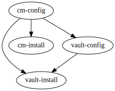

# Deploy and Setup Cert-manager and Vault with the Terraform

## Goals

1. Deploy and setup Cert-manager and Vault in test environment with Terraform.

2. Automate to configure Vault PKI Secrets Engine and Vault authentication.

3. Automate to create a ClusterIssuer that represents the certificate authority Vault.

## Dependencies Graph


## Usage Steps

### 1. Execute `terragrunt run-all init`
```
[root@master68 cm-vault]# terragrunt run-all init
INFO[0000] The stack at /root/lonelyCZ/terraform-cm/cm-vault will be processed in the following order for command init:
Group 1
- Module /root/lonelyCZ/terraform-cm/cm-vault/cm-install
- Module /root/lonelyCZ/terraform-cm/cm-vault/vault-install

Group 2
- Module /root/lonelyCZ/terraform-cm/cm-vault/vault-config

Group 3
- Module /root/lonelyCZ/terraform-cm/cm-vault/cm-config


Initializing the backend...
```
<details>

<summary>Click for more output details</summary>

```
Initializing provider plugins...
- Reusing previous version of hashicorp/helm from the dependency lock file

Initializing provider plugins...
- Reusing previous version of hashicorp/helm from the dependency lock file
- Using previously-installed hashicorp/helm v2.5.1

Terraform has been successfully initialized!

You may now begin working with Terraform. Try running "terraform plan" to see
any changes that are required for your infrastructure. All Terraform commands
should now work.

If you ever set or change modules or backend configuration for Terraform,
rerun this command to reinitialize your working directory. If you forget, other
commands will detect it and remind you to do so if necessary.

Initializing the backend...

Initializing provider plugins...
- Reusing previous version of hashicorp/vault from the dependency lock file
- Using previously-installed hashicorp/helm v2.5.1

Terraform has been successfully initialized!

You may now begin working with Terraform. Try running "terraform plan" to see
any changes that are required for your infrastructure. All Terraform commands
should now work.

If you ever set or change modules or backend configuration for Terraform,
rerun this command to reinitialize your working directory. If you forget, other
commands will detect it and remind you to do so if necessary.
- Using previously-installed hashicorp/vault v3.5.0

Terraform has been successfully initialized!

You may now begin working with Terraform. Try running "terraform plan" to see
any changes that are required for your infrastructure. All Terraform commands
should now work.

If you ever set or change modules or backend configuration for Terraform,
rerun this command to reinitialize your working directory. If you forget, other
commands will detect it and remind you to do so if necessary.

Initializing the backend...

Initializing provider plugins...
- Reusing previous version of hashicorp/kubernetes from the dependency lock file
- Using previously-installed hashicorp/kubernetes v2.11.0

Terraform has been successfully initialized!

You may now begin working with Terraform. Try running "terraform plan" to see
any changes that are required for your infrastructure. All Terraform commands
should now work.

If you ever set or change modules or backend configuration for Terraform,
rerun this command to reinitialize your working directory. If you forget, other
commands will detect it and remind you to do so if necessary.
```
</details>  


### 2. Execute `terragrunt run-all apply`

```
[root@master68 cm-vault]# terragrunt run-all apply
INFO[0000] The stack at /root/lonelyCZ/terraform-cm/cm-vault will be processed in the following order for command apply:
Group 1
- Module /root/lonelyCZ/terraform-cm/cm-vault/cm-install
- Module /root/lonelyCZ/terraform-cm/cm-vault/vault-install

Group 2
- Module /root/lonelyCZ/terraform-cm/cm-vault/vault-config

Group 3
- Module /root/lonelyCZ/terraform-cm/cm-vault/cm-config

Are you sure you want to run 'terragrunt apply' in each folder of the stack described above? (y/n) y
```

<details>

<summary>Click for more output details</summary>

```
Terraform used the selected providers to generate the following execution
plan. Resource actions are indicated with the following symbols:
  + create

Terraform will perform the following actions:

  # helm_release.vault will be created
  + resource "helm_release" "vault" {
      + atomic                     = false
      + chart                      = "vault"
      + cleanup_on_fail            = false
      + create_namespace           = true
      + dependency_update          = false
      + disable_crd_hooks          = false
      + disable_openapi_validation = false
      + disable_webhooks           = false
      + force_update               = false
      + id                         = (known after apply)
      + lint                       = false
      + manifest                   = (known after apply)
      + max_history                = 0
      + metadata                   = (known after apply)
      + name                       = "vault"
      + namespace                  = "vault"
      + recreate_pods              = false
      + render_subchart_notes      = true
      + replace                    = false
      + repository                 = "https://helm.releases.hashicorp.com"
      + reset_values               = false
      + reuse_values               = false
      + skip_crds                  = false
      + status                     = "deployed"
      + timeout                    = 300
      + verify                     = false
      + version                    = "0.20.1"
      + wait                       = true
      + wait_for_jobs              = false

      + set {
          + name  = "server.dev.enabled"
          + value = "true"
        }
      + set {
          + name  = "server.service.nodePort"
          + value = "30200"
        }
      + set {
          + name  = "server.service.type"
          + value = "NodePort"
        }
    }

Plan: 1 to add, 0 to change, 0 to destroy.

Terraform used the selected providers to generate the following execution
plan. Resource actions are indicated with the following symbols:
  + create

Terraform will perform the following actions:

  # helm_release.cert-manager will be created
  + resource "helm_release" "cert-manager" {
      + atomic                     = false
      + chart                      = "cert-manager"
      + cleanup_on_fail            = false
      + create_namespace           = true
      + dependency_update          = false
      + disable_crd_hooks          = false
      + disable_openapi_validation = false
      + disable_webhooks           = false
      + force_update               = false
      + id                         = (known after apply)
      + lint                       = false
      + manifest                   = (known after apply)
      + max_history                = 0
      + metadata                   = (known after apply)
      + name                       = "cert-manager"
      + namespace                  = "cert-manager"
      + recreate_pods              = false
      + render_subchart_notes      = true
      + replace                    = false
      + repository                 = "https://charts.jetstack.io"
      + reset_values               = false
      + reuse_values               = false
      + skip_crds                  = false
      + status                     = "deployed"
      + timeout                    = 300
      + verify                     = false
      + version                    = "v1.8.0"
      + wait                       = true
      + wait_for_jobs              = false

      + set {
          + name  = "installCRDs"
          + value = "true"
        }
    }

Plan: 1 to add, 0 to change, 0 to destroy.
helm_release.vault: Creating...
helm_release.cert-manager: Creating...
helm_release.vault: Still creating... [10s elapsed]
helm_release.cert-manager: Still creating... [10s elapsed]
helm_release.vault: Creation complete after 12s [id=vault]

Apply complete! Resources: 1 added, 0 changed, 0 destroyed.

Terraform used the selected providers to generate the following execution
plan. Resource actions are indicated with the following symbols:
  + create

Terraform will perform the following actions:

  # vault_mount.pki will be created
  + resource "vault_mount" "pki" {
      + accessor                     = (known after apply)
      + audit_non_hmac_request_keys  = (known after apply)
      + audit_non_hmac_response_keys = (known after apply)
      + default_lease_ttl_seconds    = (known after apply)
      + external_entropy_access      = false
      + id                           = (known after apply)
      + max_lease_ttl_seconds        = 31536000
      + path                         = "pki"
      + seal_wrap                    = (known after apply)
      + type                         = "pki"
    }

  # vault_pki_secret_backend_role.role will be created
  + resource "vault_pki_secret_backend_role" "role" {
      + allow_any_name                     = false
      + allow_bare_domains                 = false
      + allow_glob_domains                 = false
      + allow_ip_sans                      = true
      + allow_localhost                    = true
      + allow_subdomains                   = true
      + allowed_domains                    = [
          + "cert-manager.io",
        ]
      + allowed_domains_template           = false
      + backend                            = "pki"
      + basic_constraints_valid_for_non_ca = false
      + client_flag                        = true
      + code_signing_flag                  = false
      + email_protection_flag              = false
      + enforce_hostnames                  = true
      + generate_lease                     = false
      + id                                 = (known after apply)
      + key_bits                           = 2048
      + key_type                           = "rsa"
      + name                               = "cert-manager-io"
      + no_store                           = false
      + not_before_duration                = (known after apply)
      + require_cn                         = true
      + server_flag                        = true
      + ttl                                = "31536000"
      + use_csr_common_name                = true
      + use_csr_sans                       = true
    }

  # vault_pki_secret_backend_root_cert.ca will be created
  + resource "vault_pki_secret_backend_root_cert" "ca" {
      + backend              = "pki"
      + certificate          = (known after apply)
      + common_name          = "cert-manager.io"
      + exclude_cn_from_sans = true
      + format               = "pem"
      + id                   = (known after apply)
      + issuing_ca           = (known after apply)
      + key_bits             = 2048
      + key_type             = "rsa"
      + max_path_length      = -1
      + private_key_format   = "der"
      + serial               = (known after apply)
      + ttl                  = "31536000"
      + type                 = "internal"
    }

Plan: 3 to add, 0 to change, 0 to destroy.
vault_mount.pki: Creating...
vault_mount.pki: Creation complete after 1s [id=pki]
vault_pki_secret_backend_root_cert.ca: Creating...
vault_pki_secret_backend_role.role: Creating...
vault_pki_secret_backend_role.role: Creation complete after 0s [id=pki/roles/cert-manager-io]
vault_pki_secret_backend_root_cert.ca: Creation complete after 0s [id=pki/root/generate/internal]

Apply complete! Resources: 3 added, 0 changed, 0 destroyed.
helm_release.cert-manager: Still creating... [20s elapsed]
helm_release.cert-manager: Still creating... [30s elapsed]
helm_release.cert-manager: Still creating... [40s elapsed]
helm_release.cert-manager: Still creating... [50s elapsed]
helm_release.cert-manager: Still creating... [1m0s elapsed]
helm_release.cert-manager: Still creating... [1m10s elapsed]
helm_release.cert-manager: Still creating... [1m20s elapsed]
helm_release.cert-manager: Creation complete after 1m23s [id=cert-manager]

Apply complete! Resources: 1 added, 0 changed, 0 destroyed.

Terraform used the selected providers to generate the following execution
plan. Resource actions are indicated with the following symbols:
  + create

Terraform will perform the following actions:

  # kubernetes_manifest.vault-issuer will be created
  + resource "kubernetes_manifest" "vault-issuer" {
      + manifest = {
          + apiVersion = "cert-manager.io/v1"
          + kind       = "ClusterIssuer"
          + metadata   = {
              + name = "vault-issuer"
            }
          + spec       = {
              + vault = {
                  + auth   = {
                      + tokenSecretRef = {
                          + key  = "token"
                          + name = "vault-token"
                        }
                    }
                  + path   = "pki/sign/example-dot-com"
                  + server = "http://vault.vault.svc:8200"
                }
            }
        }
      + object   = {
          + apiVersion = "cert-manager.io/v1"
          + kind       = "ClusterIssuer"
          + metadata   = {
              + annotations                = (known after apply)
              + clusterName                = (known after apply)
              + creationTimestamp          = (known after apply)
              + deletionGracePeriodSeconds = (known after apply)
              + deletionTimestamp          = (known after apply)
              + finalizers                 = (known after apply)
              + generateName               = (known after apply)
              + generation                 = (known after apply)
              + labels                     = (known after apply)
              + managedFields              = (known after apply)
              + name                       = "vault-issuer"
              + namespace                  = (known after apply)
              + ownerReferences            = (known after apply)
              + resourceVersion            = (known after apply)
              + selfLink                   = (known after apply)
              + uid                        = (known after apply)
            }
          + spec       = {
              + acme       = {
                  + disableAccountKeyGeneration = (known after apply)
                  + email                       = (known after apply)
                  + enableDurationFeature       = (known after apply)
                  + externalAccountBinding      = {
                      + keyAlgorithm = (known after apply)
                      + keyID        = (known after apply)
                      + keySecretRef = {
                          + key  = (known after apply)
                          + name = (known after apply)
                        }
                    }
                  + preferredChain              = (known after apply)
                  + privateKeySecretRef         = {
                      + key  = (known after apply)
                      + name = (known after apply)
                    }
                  + server                      = (known after apply)
                  + skipTLSVerify               = (known after apply)
                  + solvers                     = (known after apply)
                }
              + ca         = {
                  + crlDistributionPoints = (known after apply)
                  + ocspServers           = (known after apply)
                  + secretName            = (known after apply)
                }
              + selfSigned = {
                  + crlDistributionPoints = (known after apply)
                }
              + vault      = {
                  + auth      = {
                      + appRole        = {
                          + path      = (known after apply)
                          + roleId    = (known after apply)
                          + secretRef = {
                              + key  = (known after apply)
                              + name = (known after apply)
                            }
                        }
                      + kubernetes     = {
                          + mountPath = (known after apply)
                          + role      = (known after apply)
                          + secretRef = {
                              + key  = (known after apply)
                              + name = (known after apply)
                            }
                        }
                      + tokenSecretRef = {
                          + key  = "token"
                          + name = "vault-token"
                        }
                    }
                  + caBundle  = (known after apply)
                  + namespace = (known after apply)
                  + path      = "pki/sign/example-dot-com"
                  + server    = "http://vault.vault.svc:8200"
                }
              + venafi     = {
                  + cloud = {
                      + apiTokenSecretRef = {
                          + key  = (known after apply)
                          + name = (known after apply)
                        }
                      + url               = (known after apply)
                    }
                  + tpp   = {
                      + caBundle       = (known after apply)
                      + credentialsRef = {
                          + name = (known after apply)
                        }
                      + url            = (known after apply)
                    }
                  + zone  = (known after apply)
                }
            }
        }
    }

  # kubernetes_secret_v1.vault-token will be created
  + resource "kubernetes_secret_v1" "vault-token" {
      + data = (sensitive value)
      + id   = (known after apply)
      + type = "opaque"

      + metadata {
          + generation       = (known after apply)
          + name             = "vault-token"
          + namespace        = "cert-manager"
          + resource_version = (known after apply)
          + uid              = (known after apply)
        }
    }

Plan: 2 to add, 0 to change, 0 to destroy.
kubernetes_secret_v1.vault-token: Creating...
kubernetes_secret_v1.vault-token: Creation complete after 0s [id=cert-manager/vault-token]
kubernetes_manifest.vault-issuer: Creating...
kubernetes_manifest.vault-issuer: Creation complete after 1s

Apply complete! Resources: 2 added, 0 changed, 0 destroyed.
```
</details>

### 3. View Deployment Results

```
[root@master68 cm-vault]# kubectl get pod -A
NAMESPACE      NAME                                      READY   STATUS    RESTARTS        AGE
cert-manager   cert-manager-6bbf595697-sdzvd             1/1     Running   0               3m29s
cert-manager   cert-manager-cainjector-6bc9d758b-g225g   1/1     Running   0               3m29s
cert-manager   cert-manager-webhook-586d45d5ff-wgfx2     1/1     Running   0               3m29s
default        nginx-6799fc88d8-f6m92                    1/1     Running   3 (17h ago)     29d
kube-system    coredns-7f6cbbb7b8-77wjk                  1/1     Running   14 (17h ago)    196d
kube-system    coredns-7f6cbbb7b8-hhp8x                  1/1     Running   14 (17h ago)    196d
kube-system    etcd-master68                             1/1     Running   9 (17h ago)     85d
kube-system    kube-apiserver-master68                   1/1     Running   211 (17h ago)   85d
kube-system    kube-controller-manager-master68          1/1     Running   61 (17h ago)    85d
kube-system    kube-flannel-ds-4zh8n                     1/1     Running   8 (3d20h ago)   102d
kube-system    kube-flannel-ds-9w82j                     1/1     Running   17 (17h ago)    196d
kube-system    kube-proxy-hc8mk                          1/1     Running   6 (3d20h ago)   102d
kube-system    kube-proxy-v855g                          1/1     Running   5 (17h ago)     36d
kube-system    kube-scheduler-master68                   1/1     Running   58 (17h ago)    85d
vault          vault-0                                   1/1     Running   0               3m32s
vault          vault-agent-injector-5b5889ffb4-fdfhq     1/1     Running   0               3m32s
```

### 4. Check Status of `ClusterIssuer`

```
[root@master68 cm-vault]# kubectl get clusterissuers -o wide
NAME           READY   STATUS           AGE
vault-issuer   True    Vault verified   2m57s
```

### 5. Destroy Test Environment.

```
[root@master68 cm-vault]# terragrunt run-all destroy
INFO[0000] The stack at /root/lonelyCZ/terraform-cm/cm-vault will be processed in the following order for command destroy:
Group 1
- Module /root/lonelyCZ/terraform-cm/cm-vault/cm-config

Group 2
- Module /root/lonelyCZ/terraform-cm/cm-vault/cm-install
- Module /root/lonelyCZ/terraform-cm/cm-vault/vault-config

Group 3
- Module /root/lonelyCZ/terraform-cm/cm-vault/vault-install

WARNING: Are you sure you want to run `terragrunt destroy` in each folder of the stack described above? There is no undo! (y/n) y
```
<details>

<summary>Click for more output details</summary>

```
kubernetes_secret_v1.vault-token: Refreshing state... [id=cert-manager/vault-token]
kubernetes_manifest.vault-issuer: Refreshing state...

Terraform used the selected providers to generate the following execution
plan. Resource actions are indicated with the following symbols:
  - destroy

Terraform will perform the following actions:

  # kubernetes_manifest.vault-issuer will be destroyed
  - resource "kubernetes_manifest" "vault-issuer" {
      - manifest = {
          - apiVersion = "cert-manager.io/v1"
          - kind       = "ClusterIssuer"
          - metadata   = {
              - name = "vault-issuer"
            }
          - spec       = {
              - vault = {
                  - auth   = {
                      - tokenSecretRef = {
                          - key  = "token"
                          - name = "vault-token"
                        }
                    }
                  - path   = "pki/sign/example-dot-com"
                  - server = "http://vault.vault.svc:8200"
                }
            }
        } -> null
      - object   = {
          - apiVersion = "cert-manager.io/v1"
          - kind       = "ClusterIssuer"
          - metadata   = {
              - annotations                = null
              - clusterName                = null
              - creationTimestamp          = null
              - deletionGracePeriodSeconds = null
              - deletionTimestamp          = null
              - finalizers                 = null
              - generateName               = null
              - generation                 = null
              - labels                     = null
              - managedFields              = null
              - name                       = "vault-issuer"
              - namespace                  = null
              - ownerReferences            = null
              - resourceVersion            = null
              - selfLink                   = null
              - uid                        = null
            }
          - spec       = {
              - acme       = {
                  - disableAccountKeyGeneration = null
                  - email                       = null
                  - enableDurationFeature       = null
                  - externalAccountBinding      = {
                      - keyAlgorithm = null
                      - keyID        = null
                      - keySecretRef = {
                          - key  = null
                          - name = null
                        }
                    }
                  - preferredChain              = null
                  - privateKeySecretRef         = {
                      - key  = null
                      - name = null
                    }
                  - server                      = null
                  - skipTLSVerify               = null
                  - solvers                     = null
                }
              - ca         = {
                  - crlDistributionPoints = null
                  - ocspServers           = null
                  - secretName            = null
                }
              - selfSigned = {
                  - crlDistributionPoints = null
                }
              - vault      = {
                  - auth      = {
                      - appRole        = {
                          - path      = null
                          - roleId    = null
                          - secretRef = {
                              - key  = null
                              - name = null
                            }
                        }
                      - kubernetes     = {
                          - mountPath = null
                          - role      = null
                          - secretRef = {
                              - key  = null
                              - name = null
                            }
                        }
                      - tokenSecretRef = {
                          - key  = "token"
                          - name = "vault-token"
                        }
                    }
                  - caBundle  = null
                  - namespace = null
                  - path      = "pki/sign/example-dot-com"
                  - server    = "http://vault.vault.svc:8200"
                }
              - venafi     = {
                  - cloud = {
                      - apiTokenSecretRef = {
                          - key  = null
                          - name = null
                        }
                      - url               = null
                    }
                  - tpp   = {
                      - caBundle       = null
                      - credentialsRef = {
                          - name = null
                        }
                      - url            = null
                    }
                  - zone  = null
                }
            }
        } -> null
    }

  # kubernetes_secret_v1.vault-token will be destroyed
  - resource "kubernetes_secret_v1" "vault-token" {
      - data      = (sensitive value)
      - id        = "cert-manager/vault-token" -> null
      - immutable = false -> null
      - type      = "opaque" -> null

      - metadata {
          - annotations      = {} -> null
          - generation       = 0 -> null
          - labels           = {} -> null
          - name             = "vault-token" -> null
          - namespace        = "cert-manager" -> null
          - resource_version = "23882412" -> null
          - uid              = "d453578d-01a3-407f-9b97-8a4033adc98d" -> null
        }
    }

Plan: 0 to add, 0 to change, 2 to destroy.
kubernetes_manifest.vault-issuer: Destroying...
kubernetes_manifest.vault-issuer: Destruction complete after 0s
kubernetes_secret_v1.vault-token: Destroying... [id=cert-manager/vault-token]
kubernetes_secret_v1.vault-token: Destruction complete after 0s

Destroy complete! Resources: 2 destroyed.
vault_mount.pki: Refreshing state... [id=pki]
vault_pki_secret_backend_root_cert.ca: Refreshing state... [id=pki/root/generate/internal]
vault_pki_secret_backend_role.role: Refreshing state... [id=pki/roles/cert-manager-io]
helm_release.cert-manager: Refreshing state... [id=cert-manager]

Terraform used the selected providers to generate the following execution
plan. Resource actions are indicated with the following symbols:
  - destroy

Terraform will perform the following actions:

  # vault_mount.pki will be destroyed
  - resource "vault_mount" "pki" {
      - accessor                     = "pki_0c849bef" -> null
      - audit_non_hmac_request_keys  = [] -> null
      - audit_non_hmac_response_keys = [] -> null
      - default_lease_ttl_seconds    = 0 -> null
      - external_entropy_access      = false -> null
      - id                           = "pki" -> null
      - local                        = false -> null
      - max_lease_ttl_seconds        = 31536000 -> null
      - options                      = {} -> null
      - path                         = "pki" -> null
      - seal_wrap                    = false -> null
      - type                         = "pki" -> null
    }

  # vault_pki_secret_backend_role.role will be destroyed
  - resource "vault_pki_secret_backend_role" "role" {
      - allow_any_name                     = false -> null
      - allow_bare_domains                 = false -> null
      - allow_glob_domains                 = false -> null
      - allow_ip_sans                      = true -> null
      - allow_localhost                    = true -> null
      - allow_subdomains                   = true -> null
      - allowed_domains                    = [
          - "cert-manager.io",
        ] -> null
      - allowed_domains_template           = false -> null
      - allowed_other_sans                 = [] -> null
      - allowed_uri_sans                   = [] -> null
      - backend                            = "pki" -> null
      - basic_constraints_valid_for_non_ca = false -> null
      - client_flag                        = true -> null
      - code_signing_flag                  = false -> null
      - country                            = [] -> null
      - email_protection_flag              = false -> null
      - enforce_hostnames                  = true -> null
      - ext_key_usage                      = [] -> null
      - generate_lease                     = false -> null
      - id                                 = "pki/roles/cert-manager-io" -> null
      - key_bits                           = 2048 -> null
      - key_type                           = "rsa" -> null
      - key_usage                          = [
          - "DigitalSignature",
          - "KeyAgreement",
          - "KeyEncipherment",
        ] -> null
      - locality                           = [] -> null
      - max_ttl                            = "0" -> null
      - name                               = "cert-manager-io" -> null
      - no_store                           = false -> null
      - not_before_duration                = "0s" -> null
      - organization                       = [] -> null
      - ou                                 = [] -> null
      - policy_identifiers                 = [] -> null
      - postal_code                        = [] -> null
      - province                           = [] -> null
      - require_cn                         = true -> null
      - server_flag                        = true -> null
      - street_address                     = [] -> null
      - ttl                                = "31536000" -> null
      - use_csr_common_name                = true -> null
      - use_csr_sans                       = true -> null
    }

  # vault_pki_secret_backend_root_cert.ca will be destroyed
  - resource "vault_pki_secret_backend_root_cert" "ca" {
      - backend              = "pki" -> null
      - certificate          = <<-EOT
            -----BEGIN CERTIFICATE-----
            MIIDJTCCAg2gAwIBAgIUVDEbkQ+HJ1aCYANoJ4w36Lp0FMcwDQYJKoZIhvcNAQEL
            BQAwGjEYMBYGA1UEAxMPY2VydC1tYW5hZ2VyLmlvMB4XDTIyMDYxMzA2MDE0MloX
            DTIzMDYxMzA2MDIxMVowGjEYMBYGA1UEAxMPY2VydC1tYW5hZ2VyLmlvMIIBIjAN
            BgkqhkiG9w0BAQEFAAOCAQ8AMIIBCgKCAQEAzyoD+s+AEgHLWD245Ky5a3J+M0b5
            6vaCCW2cwccD1UKSubBkJhfNstU0G0+KWls959FYXTsrQQ0J9plRVjUDu6PmQBCv
            bBgMyGpbnENHUOXwWfxGvqK6YllYDj/di4HSqhgKvRoyjHeOUJNiwLlYFbSq/ReF
            dOqzrNVATdzqyB4L7v+lSYHRGzxSONYwXQsgeLVf8/kwVqs3Dp1NpnsnBsHM51lb
            b4kxrGU8XmsEFLHQMiGLDFxDsyVgUwbPKw3msBQRAAf9X+VVv8o+8UCWVCk2LNAd
            14Azz/bMd5v5AVSgFqJGn0qVRRsR0Kg8Al91dH8swvyQkkiNUZGi/CbpjwIDAQAB
            o2MwYTAOBgNVHQ8BAf8EBAMCAQYwDwYDVR0TAQH/BAUwAwEB/zAdBgNVHQ4EFgQU
            /ZC7AP05iys65oeyeO4fhWAPudkwHwYDVR0jBBgwFoAU/ZC7AP05iys65oeyeO4f
            hWAPudkwDQYJKoZIhvcNAQELBQADggEBAMXt+Lm/LYsMY/AH5k40xWIXNUZrX6NT
            0s9+pw5x7iFLVvXBTb4MUCyrrGM6ISxWsq+qC5iV7q8jIBrg4+UKhYD6smCQTX4F
            59gzKm+ZqaBNZNT8jgm13MUUx9a+jGeSrArhcvf9ywkTtTvuyFiv/E82a9K/yACv
            phAtvhwJWE1YhQb77g/TQy9puZXV0vemFBAboKu4Rd9bt6HYXWts+hDTNTFqgXOx
            4SH/W0TRt0tlkvhQFyk/+/spBAvuNiP71VR4HAn/RatL+A8kmoBmxdYSH3of3IKL
            ZRhorRGS0r6JEGFVO5Af0ej6YHF2WKQyChtNc/qHYIlT4aagDSC2ja4=
            -----END CERTIFICATE-----
        EOT -> null
      - common_name          = "cert-manager.io" -> null
      - exclude_cn_from_sans = true -> null
      - format               = "pem" -> null
      - id                   = "pki/root/generate/internal" -> null
      - issuing_ca           = <<-EOT
            -----BEGIN CERTIFICATE-----
            MIIDJTCCAg2gAwIBAgIUVDEbkQ+HJ1aCYANoJ4w36Lp0FMcwDQYJKoZIhvcNAQEL
            BQAwGjEYMBYGA1UEAxMPY2VydC1tYW5hZ2VyLmlvMB4XDTIyMDYxMzA2MDE0MloX
            DTIzMDYxMzA2MDIxMVowGjEYMBYGA1UEAxMPY2VydC1tYW5hZ2VyLmlvMIIBIjAN
            BgkqhkiG9w0BAQEFAAOCAQ8AMIIBCgKCAQEAzyoD+s+AEgHLWD245Ky5a3J+M0b5
            6vaCCW2cwccD1UKSubBkJhfNstU0G0+KWls959FYXTsrQQ0J9plRVjUDu6PmQBCv
            bBgMyGpbnENHUOXwWfxGvqK6YllYDj/di4HSqhgKvRoyjHeOUJNiwLlYFbSq/ReF
            dOqzrNVATdzqyB4L7v+lSYHRGzxSONYwXQsgeLVf8/kwVqs3Dp1NpnsnBsHM51lb
            b4kxrGU8XmsEFLHQMiGLDFxDsyVgUwbPKw3msBQRAAf9X+VVv8o+8UCWVCk2LNAd
            14Azz/bMd5v5AVSgFqJGn0qVRRsR0Kg8Al91dH8swvyQkkiNUZGi/CbpjwIDAQAB
            o2MwYTAOBgNVHQ8BAf8EBAMCAQYwDwYDVR0TAQH/BAUwAwEB/zAdBgNVHQ4EFgQU
            /ZC7AP05iys65oeyeO4fhWAPudkwHwYDVR0jBBgwFoAU/ZC7AP05iys65oeyeO4f
            hWAPudkwDQYJKoZIhvcNAQELBQADggEBAMXt+Lm/LYsMY/AH5k40xWIXNUZrX6NT
            0s9+pw5x7iFLVvXBTb4MUCyrrGM6ISxWsq+qC5iV7q8jIBrg4+UKhYD6smCQTX4F
            59gzKm+ZqaBNZNT8jgm13MUUx9a+jGeSrArhcvf9ywkTtTvuyFiv/E82a9K/yACv
            phAtvhwJWE1YhQb77g/TQy9puZXV0vemFBAboKu4Rd9bt6HYXWts+hDTNTFqgXOx
            4SH/W0TRt0tlkvhQFyk/+/spBAvuNiP71VR4HAn/RatL+A8kmoBmxdYSH3of3IKL
            ZRhorRGS0r6JEGFVO5Af0ej6YHF2WKQyChtNc/qHYIlT4aagDSC2ja4=
            -----END CERTIFICATE-----
        EOT -> null
      - key_bits             = 2048 -> null
      - key_type             = "rsa" -> null
      - max_path_length      = -1 -> null
      - private_key_format   = "der" -> null
      - serial               = "54:31:1b:91:0f:87:27:56:82:60:03:68:27:8c:37:e8:ba:74:14:c7" -> null
      - ttl                  = "31536000" -> null
      - type                 = "internal" -> null
    }

Plan: 0 to add, 0 to change, 3 to destroy.
vault_pki_secret_backend_role.role: Destroying... [id=pki/roles/cert-manager-io]
vault_pki_secret_backend_root_cert.ca: Destroying... [id=pki/root/generate/internal]
vault_pki_secret_backend_role.role: Destruction complete after 0s
vault_pki_secret_backend_root_cert.ca: Destruction complete after 0s
vault_mount.pki: Destroying... [id=pki]
vault_mount.pki: Destruction complete after 0s

Destroy complete! Resources: 3 destroyed.
helm_release.vault: Refreshing state... [id=vault]

Terraform used the selected providers to generate the following execution
plan. Resource actions are indicated with the following symbols:
  - destroy

Terraform will perform the following actions:

  # helm_release.vault will be destroyed
  - resource "helm_release" "vault" {
      - atomic                     = false -> null
      - chart                      = "vault" -> null
      - cleanup_on_fail            = false -> null
      - create_namespace           = true -> null
      - dependency_update          = false -> null
      - disable_crd_hooks          = false -> null
      - disable_openapi_validation = false -> null
      - disable_webhooks           = false -> null
      - force_update               = false -> null
      - id                         = "vault" -> null
      - lint                       = false -> null
      - max_history                = 0 -> null
      - metadata                   = [
          - {
              - app_version = "1.10.3"
              - chart       = "vault"
              - name        = "vault"
              - namespace   = "vault"
              - revision    = 1
              - values      = jsonencode(
                    {
                      - server = {
                          - dev     = {
                              - enabled = true
                            }
                          - service = {
                              - nodePort = 30200
                              - type     = "NodePort"
                            }
                        }
                    }
                )
              - version     = "0.20.1"
            },
        ] -> null
      - name                       = "vault" -> null
      - namespace                  = "vault" -> null
      - recreate_pods              = false -> null
      - render_subchart_notes      = true -> null
      - replace                    = false -> null
      - repository                 = "https://helm.releases.hashicorp.com" -> null
      - reset_values               = false -> null
      - reuse_values               = false -> null
      - skip_crds                  = false -> null
      - status                     = "deployed" -> null
      - timeout                    = 300 -> null
      - verify                     = false -> null
      - version                    = "0.20.1" -> null
      - wait                       = true -> null
      - wait_for_jobs              = false -> null

      - set {
          - name  = "server.dev.enabled" -> null
          - value = "true" -> null
        }
      - set {
          - name  = "server.service.nodePort" -> null
          - value = "30200" -> null
        }
      - set {
          - name  = "server.service.type" -> null
          - value = "NodePort" -> null
        }
    }

Plan: 0 to add, 0 to change, 1 to destroy.

Terraform used the selected providers to generate the following execution
plan. Resource actions are indicated with the following symbols:
  - destroy

Terraform will perform the following actions:

  # helm_release.cert-manager will be destroyed
  - resource "helm_release" "cert-manager" {
      - atomic                     = false -> null
      - chart                      = "cert-manager" -> null
      - cleanup_on_fail            = false -> null
      - create_namespace           = true -> null
      - dependency_update          = false -> null
      - disable_crd_hooks          = false -> null
      - disable_openapi_validation = false -> null
      - disable_webhooks           = false -> null
      - force_update               = false -> null
      - id                         = "cert-manager" -> null
      - lint                       = false -> null
      - max_history                = 0 -> null
      - metadata                   = [
          - {
              - app_version = "v1.8.0"
              - chart       = "cert-manager"
              - name        = "cert-manager"
              - namespace   = "cert-manager"
              - revision    = 1
              - values      = jsonencode(
                    {
                      - installCRDs = true
                    }
                )
              - version     = "v1.8.0"
            },
        ] -> null
      - name                       = "cert-manager" -> null
      - namespace                  = "cert-manager" -> null
      - recreate_pods              = false -> null
      - render_subchart_notes      = true -> null
      - replace                    = false -> null
      - repository                 = "https://charts.jetstack.io" -> null
      - reset_values               = false -> null
      - reuse_values               = false -> null
      - skip_crds                  = false -> null
      - status                     = "deployed" -> null
      - timeout                    = 300 -> null
      - verify                     = false -> null
      - version                    = "v1.8.0" -> null
      - wait                       = true -> null
      - wait_for_jobs              = false -> null

      - set {
          - name  = "installCRDs" -> null
          - value = "true" -> null
        }
    }

Plan: 0 to add, 0 to change, 1 to destroy.
helm_release.vault: Destroying... [id=vault]
helm_release.cert-manager: Destroying... [id=cert-manager]
helm_release.vault: Destruction complete after 1s

Destroy complete! Resources: 1 destroyed.
helm_release.cert-manager: Destruction complete after 3s

Destroy complete! Resources: 1 destroyed.
```
</details>
